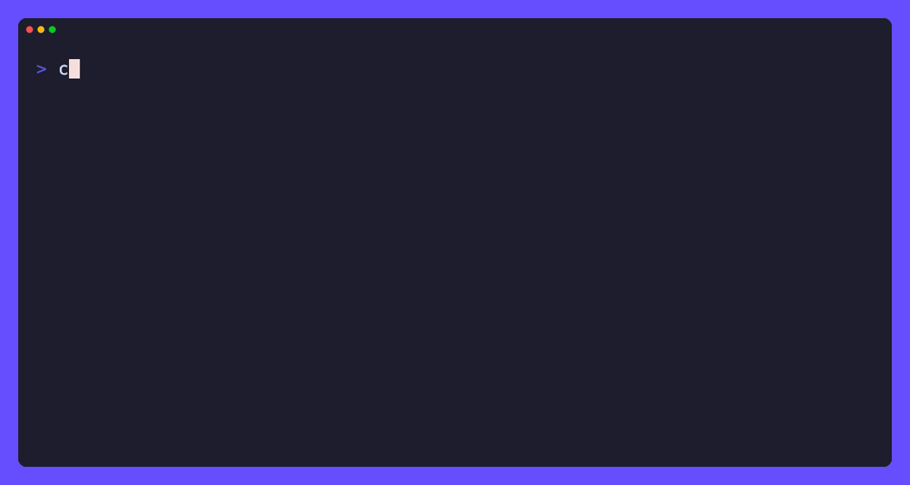

# cfggo

> **Type-safe, hot-reloadable configuration for Go. No untyped lookups, no boilerplate.**

[](https://pkg.go.dev/github.com/iqhive/cfggo)
[](https://goreportcard.com/report/github.com/iqhive/cfggo)
[](https://github.com/iqhive/cfggo/actions)
[](https://codecov.io/gh/iqhive/cfggo)
[](LICENSE)
[](https://github.com/iqhive/cfggo/releases)

**Status:** `v1.x` · production-ready · follows [Semantic Versioning](https://semver.org).

`cfggo` loads configuration from files, environment variables, command-line
flags, and HTTP endpoints, and gives you **compile-time type safety** and
**runtime hot reloading** — without the stringly-typed key lookups you get from
most config libraries.

```go
type Config struct {
    cfggo.Structure
    ServerPort func() int    `cfggo:"server_port" default:"8080" help:"Port to listen on"`
    LogLevel   func() string `cfggo:"log_level"   default:"info" help:"Logging level"`
}

config := &Config{}
if err := cfggo.Init(config, cfggo.WithFileConfig("config.json")); err != nil {
    log.Fatal(err)
}

// No config.GetInt("server_port") — just call the typed accessor:
port := config.ServerPort() // returns int, checked at compile time
```

> ℹ️ Yes, accessors are **functions** (`config.ServerPort()`), not plain fields —
> that's exactly what makes typed access survive a hot reload, with built-in
> locking and no half-initialised zero values. See
> [Why functions instead of struct fields?](#why-functions-instead-of-struct-fields).

> ℹ️ **Used in production at [iQ Hive](https://github.com/iqhive).** API is
> stable and follows [Semantic Versioning](https://semver.org) — `v1.x` will not
> make breaking changes.



> *Editing `config.json` while the app runs — the typed accessors return the new
> values instantly, no restart.*

---

## Why cfggo?

The Go config space is crowded. cfggo's niche is the combination of **typed
accessors that stay correct across a live reload**, from one small dependency:

| | **cfggo** | Viper | envconfig | koanf |
|---|:---:|:---:|:---:|:---:|
| Compile-time type-safe access | ✅ accessors | ❌ `Get*` by string key | ✅ struct fields | ⚠️ via `Unmarshal` |
| Reload reflected in typed accessors | ✅ automatic | ⚠️ re-read after `WatchConfig` | ❌ | ⚠️ manual re-unmarshal |
| Files / Env / Flags / HTTP | ✅ | ✅ | Env only | ✅ |
| Built-in validators | ✅ | ❌ | ⚠️ `required` | ❌ |
| Coexists with stdlib `flag` | ✅ | ⚠️ | ❌ | ⚠️ |
| Value provenance (`Explain`/`Source`) | ✅ | ❌ | ❌ | ❌ |
| Dependencies | Minimal | Many | None | Minimal |

> *Comparison reflects each library as of June 2026 and is necessarily a
> simplification; corrections and updates are welcome via PR.*

**Pick cfggo** if you want strongly-typed config access that *stays typed across live reloads*, plus provenance and validation, from one small dependency.
**Reach for Viper** if you need its large built-in format ecosystem (YAML/TOML/HCL/INI/etc.) out of the box and don't mind untyped lookups. *(cfggo reads JSON natively; other formats are a few lines via a custom `ConfigHandler` —
see the [FAQ](#faq).)*

---

## Table of Contents

- [Why cfggo?](#why-cfggo)
- [Installation](#installation)
- [Quick Start](#quick-start)
- [Why functions instead of struct fields?](#why-functions-instead-of-struct-fields)
- [Configuration Sources and Precedence](#configuration-sources-and-precedence)
- [Hot Reloading](#hot-reloading)
- [Validation](#validation)
- [Secrets and Redaction](#secrets-and-redaction)
- [Debugging: where did this value come from?](#debugging-where-did-this-value-come-from)
- [FAQ](#faq)

<details>
<summary><b>Full API reference</b> (struct tags, supported types, flags, runtime API, advanced features…)</summary>

- [How It Works](#how-it-works)
- [Key Features](#key-features)
- [Struct Tags and Field Naming](#struct-tags-and-field-naming)
- [Supported Types](#supported-types)
- [Environment Variables](#environment-variables)
- [Command-Line Flags](#command-line-flags)
- [Reading and Setting Values at Runtime](#reading-and-setting-values-at-runtime)
- [Saving Configuration](#saving-configuration)
- [Performance](#performance)
- [Advanced Features](#advanced-features)
  - [Configuration Options](#configuration-options)
- [Thread Safety](#thread-safety)
- [Examples](#examples)

</details>

- [Contributing](#contributing)
- [License](#license)
- [Acknowledgments](#acknowledgments)

---

## Installation

```sh
go get github.com/iqhive/cfggo
```

Requires Go 1.21+.

## Quick Start

A complete, runnable program. Copy both files into an empty directory and run
`go run .`:

```go
// main.go
package main

import (
    "fmt"
    "log"

    "github.com/iqhive/cfggo"
)

// Define configuration items as functions that return the desired type.
// The `default` tag supplies the fallback value when nothing else sets it.
type MyConfig struct {
    cfggo.Structure // Embed the Structure type

    ServerPort   func() int             `cfggo:"server_port" default:"8080" help:"Port for the server to listen on"`
    DatabaseURL  func() string          `cfggo:"db_url"      default:"postgres://localhost:5432/mydb" help:"Database connection URL"`
    FeatureFlags func() map[string]bool `cfggo:"features"    default:"{\"new_ui\": false, \"analytics\": true}" help:"Feature flags"`
    LogLevel     func() string          `cfggo:"log_level"   default:"info" help:"Logging level"`
}

func main() {
    config := &MyConfig{}

    // Init loads values from a JSON file, environment variables, and
    // command-line flags, and returns an error if anything fails.
    if err := cfggo.Init(config, cfggo.WithFileConfig("config.json")); err != nil {
        log.Fatalf("load config: %v", err)
    }

    // Access configuration values through the typed accessor functions.
    fmt.Printf("Server will listen on port %d\n", config.ServerPort())
    fmt.Printf("Database URL: %s\n", config.DatabaseURL())
    fmt.Printf("Log level: %s\n", config.LogLevel())

    if config.FeatureFlags()["new_ui"] {
        fmt.Println("New UI is enabled")
    }
}
```

```json
// config.json
{
    "server_port": 9090,
    "log_level": "debug",
    "features": { "new_ui": true, "analytics": true }
}
```

Run it, and try overriding a value from the environment or a flag to see
precedence in action:

```sh
go run .                          # uses config.json (port 9090)
SERVER_PORT=7000 go run .         # env overrides the file (port 7000)
go run . --server_port=6000       # flag overrides everything (port 6000)
```

> **Prefer defaults in code over tags?** Supply them directly with the
> `cfggo.DefaultValue` helper:
>
> ```go
> config := &MyConfig{
>     ServerPort:  cfggo.DefaultValue(8080),
>     DatabaseURL: cfggo.DefaultValue("postgres://localhost:5432/mydb"),
>     LogLevel:    cfggo.DefaultValue("info"),
> }
> ```
>
> `DefaultValue` clones mutable defaults (maps, slices, and pointers) on each
> call. Use `cfggo.DefaultClone(...)` when you want to make that behavior
> explicit at the declaration site. The clone is a top-level defensive copy:
> mutating a returned map, slice, or pointer before `Init` will not mutate the
> original default captured in your struct literal.

## Why functions instead of struct fields?

cfggo accessors are functions (`config.ServerPort()`), not plain fields
(`config.ServerPort`). This looks unusual at first, but it's the whole point of
the design:

- **Always current, never half-initialised.** A plain field can be read *before*
  config is loaded and silently hand you a zero value. A function call always
  returns the fully-resolved, current value.
- **Hot reload is transparent.** After a reload, `config.ServerPort()` returns
  the new value with **zero changes to your call sites** — no re-unmarshalling,
  no stale copies passed around your app.
- **Thread-safe by construction.** The accessor takes the read lock for you, so
  a concurrent reload and read can never race. You can't forget to lock.
- **Still fully type-safe.** The function's return type *is* the value's type,
  checked by the compiler. Rename or retype a field and mismatched call sites
  fail to build — unlike string-keyed `Get`/`GetInt` lookups.

In short: the function indirection is what buys you *typed* access and *live*
reload at the same time.

### Two pitfalls of the function pattern

Because each field is a `func() T`, two mistakes are worth knowing about:

- **Don't call an accessor before `Init`.** cfggo installs the reading closures
  during `Init`, so a field left at its nil zero value (no `DefaultValue`
  assigned) is a nil function and `config.ServerPort()` will panic. Always call
  `Init`/`InitSelf` at startup before reading. Assigning
  `ServerPort: cfggo.DefaultValue(8080)` makes a field safe to read even before
  `Init`, since it already holds a real function. For mutable defaults,
  `DefaultValue` returns a fresh top-level map, slice, or pointer value on each
  call.
- **Declare fields as `func() T`, not plain `T`.** A field written as
  `ServerPort int` with a `cfggo` tag is silently *not* a config field — it is
  never loaded or reloaded. cfggo now logs a warning during `Init` for any
  `cfggo`/`cfg`/`config`-tagged field that is not a `func() T`, so this shows up
  in your logs instead of failing mysteriously at runtime.

## How It Works

`cfggo` uses a function-based approach to configuration management:

1. **Function-based access**: You define functions that return the values.
2. **Embedded structure**: Your configuration struct embeds the `cfggo.Structure` type.
3. **Type safety**: The return type of each function defines the type of the configuration value.
4. **Hot reloading**: Configuration can be reloaded at runtime, and all functions return the updated values.

## Key Features

- **Type-safe configuration**: All values are accessed through strongly-typed functions.
- **Hot reloadable**: Reload at runtime without restarting your application.
- **Multiple configuration sources**: JSON files, environment variables, command-line flags, and HTTP endpoints — or plug in your own.
- **Command-line flag integration**: Seamless integration with Go's `flag` package, including coexisting with `flag.CommandLine`.
- **Thread-safe**: All operations are protected by per-instance mutexes.
- **Validation support**: Register per-key validators, with a rich set of built-in validators included.
- **Default values**: Specify defaults via struct tags or in code.
- **Automatic type conversion**: Strings, numbers, booleans, slices, maps, `time.Duration`, `time.Time`, and any `encoding.TextUnmarshaler` are converted automatically.
- **Change notifications**: Subscribe to value changes with `OnChange` callbacks.
- **Provenance tracking**: Ask where any value came from (default, file, env, flag, …) via `Source`/`Explain`.
- **Sentinel errors**: Branch on `errors.Is` against exported sentinels instead of matching strings.

## Struct Tags and Field Naming

cfggo recognises these struct tags on your config fields:

| Tag | Purpose |
|---|---|
| `cfggo:"name"` | The configuration key (used for file keys, env vars, and flags). |
| `default:"value"` | The fallback value, parsed into the field's type. |
| `help:"text"` | Description shown in `--help` output, `String()`, and `Explain()`. |
| `secret:"true"` | Marks the value sensitive so human-readable diagnostics redact it. |

**Choosing the config key.** If no `cfggo` tag is present, cfggo falls back —
in order — to the `cfg`, `config`, and `json` tags, and finally to the Go field
name. Comma options (e.g. `json:"name,omitempty"`) are stripped, so existing
JSON-tagged structs work without changes:

```go
type MyConfig struct {
    cfggo.Structure
    Port    func() int    `cfggo:"port"`           // key: "port"
    Host    func() string `json:"host,omitempty"`  // key: "host"
    Timeout func() int                              // key: "Timeout" (field name)
}
```

By default, the final Go-field-name fallback is used as-is for backwards
compatibility. To make untagged fields use snake_case, set
`cfggo.DefaultSnakeCaseFieldNames = true` before initialising configs, or opt in
per config with `cfggo.WithSnakeCaseFieldNames(true)`:

```go
type MyConfig struct {
    cfggo.Structure
    ServerPort func() int // key: "server_port" when snake_case naming is enabled
}

cfggo.Init(config, cfggo.WithSnakeCaseFieldNames(true))
```

**Ignoring a field.** Tag a field with `-` to exclude it from configuration
entirely (no key, env var, or flag is created):

```go
Internal func() string `cfggo:"-"` // never loaded or exposed as config
```

## Configuration Sources and Precedence

`cfggo` loads configuration from multiple sources in the following order (later
sources override earlier ones):

1. **Struct field defaults**: Set in code using `cfggo.DefaultValue()`.
2. **`default` struct tags**: The `default:"..."` tag value.
3. **Configuration files**: JSON files loaded via options (or any custom `ConfigHandler`).
4. **Environment variables**: Automatically mapped from config keys (e.g., `server_port` → `SERVER_PORT`).
5. **Command-line flags**: Automatically registered based on your struct fields.

If a field has both a caller-supplied accessor/default function and a
`default:"..."` tag, the supplied function wins before file/env/flag layers are
applied.

## Supported Types

A config field can be a `func() T` for any of the following `T`. cfggo converts
incoming values (JSON, environment strings, flag strings, and `default` tags)
into the field's declared type automatically:

| Category | Types |
|---|---|
| Scalars | `string`, `bool`, all sized `int`/`uint`, `float32`, `float64` |
| Time | `time.Duration` (e.g. `"1h30m"`), `time.Time` (RFC 3339) |
| Slices | `[]string`, `[]int`, `[]bool`, `[]float32`, `[]float64`, … |
| Maps | `map[string]string`, `map[string]interface{}`, … |
| Custom | Any type implementing `encoding.TextUnmarshaler`; otherwise JSON-decoded |

**String formats for collections.** When a value arrives as a single string
(common for flags and environment variables), slices accept a JSON array, a
comma-separated list, or a single value; maps accept a JSON object or compact
`key:value,key:value` pairs:

```text
--tags '["a","b"]'      # JSON array
--tags a,b,c            # comma-separated
--tags single           # single value -> ["single"]
--limits '{"cpu":2}'    # JSON object for a map field
--limits cpu:2,mem:4    # key:value pairs for a map field
```

**Flexible booleans.** Boolean values accept `true/false`, `t/f`, `yes/no`,
`y/n`, and `1/0` (case-insensitive), from any source.

**JSON object and null behavior.** Nested JSON objects are flattened into dotted
keys (`{"database":{"host":"db"}}` -> `database.host`) unless the object is
itself the value for a known accessor leaf, such as a map or struct-valued
`func() T`. An explicit JSON `null` resets a known key to that field's typed zero
value.

## Environment Variables

Environment variables are automatically mapped from your configuration keys:

- Keys are converted to uppercase.
- Dots (`.`) are replaced with underscores (`_`).
- Use `cfggo.WithEnvConfig()` to read raw, unprefixed variables such as `PORT`.
- Use `cfggo.WithEnvPrefix("MYAPP_")` to read the automatic env layer from a
  prefixed namespace such as `MYAPP_PORT`.
- Use `cfggo.WithoutEnv()` when you want files/defaults/flags only.

For example:

- `server_port` → `SERVER_PORT`
- `db.url` → `DB_URL`
- with `WithEnvPrefix("MYAPP_")`, `server_port` → `MYAPP_SERVER_PORT`

## Command-Line Flags

Command-line flags are automatically registered based on your struct fields. The
flag name is the same as the configuration key.

```text
--server_port=8080
--db_url="postgres://localhost:5432/mydb"
--log_level=debug
```

Boolean flags can be used with or without a value:

```text
--feature_enabled        # Sets to true
--feature_enabled=true   # Sets to true
--feature_enabled=false  # Sets to false
--feature_enabled false  # Sets to false (cfggo normalizes bool literals)
```

cfggo keeps the normal `--bool` shorthand, but is also more forgiving than the
standard `flag` package for known boolean config flags: when a boolean flag is
followed by a supported boolean literal (`true/false`, `t/f`, `yes/no`, `y/n`,
`1/0`), cfggo treats it like `--flag=value` so later flags still parse. If the
following token is not a boolean literal, the flag is treated as a bare `true`
flag and the token remains positional.

### Parsing model and interop with the standard `flag` package

By default, cfggo creates its own private `*flag.FlagSet` and parses
`os.Args` for you inside `Init()`. In this mode:

- You do **not** need to (and should **not**) call `flag.Parse()` yourself.
- A flag that cfggo doesn't define prints usage and terminates the process
  (`flag.ExitOnError`). Pass `cfggo.WithIgnoreUnknownVars()` to instead ignore
  unrecognized flags (and their separate values) and continue:

  ```go
  err := cfggo.Init(config, cfggo.WithIgnoreUnknownVars())
  ```

If an unrecognized flag has a close match, cfggo reports the likely intended
flag before the process exits, for example:

```text
flag provided but not defined: -verbse (did you mean -verbose?)
```

When there is no close match, cfggo falls back to the standard `flag` package
behavior and prints the full usage listing with every known cfggo flag.

If you want cfggo to coexist with the idiomatic "register flags, call
`flag.Parse()` once" pattern, register cfggo's flags on a flag set you control
and own the single parse call yourself:

```go
config := &MyConfig{ /* ... */ }

// Register cfggo's flags on the process-global flag.CommandLine.
if err := cfggo.Init(config, cfggo.WithStandardFlags()); err != nil {
    log.Fatal(err)
}
// (equivalent: cfggo.Init(config, cfggo.WithFlagSet(flag.CommandLine)))

// The host performs the one canonical parse; cfggo flags AND any other
// library's flags (glog/klog, OpenTelemetry, testing, etc.) resolve together.
flag.Parse()
```

When an external flag set is supplied via `WithFlagSet`/`WithStandardFlags`,
cfggo registers its flags but does **not** parse during `Init()` — the host owns
the single `Parse()` call. cfggo flag values still propagate automatically as the
host parses, because each flag writes directly into the config map.

Use `WithoutFlags()` when a program should not register or parse cfggo command
line flags at all. This keeps startup focused on defaults, files, environment
variables, and any custom handler. If you later need the flag set for advanced
usage, `GetFlagSet()` creates one lazily.

## Reading and Setting Values at Runtime

The typed accessor functions (`config.ServerPort()`) are the primary way to read
values, but cfggo also exposes a dynamic key/value API for code that works with
keys at runtime (admin endpoints, tooling, tests):

```go
// Read a value by key (second return reports whether the key exists).
if v, ok := config.Get("server_port"); ok {
    fmt.Println("port is", v)
}

// Set a value by key. The value is converted to the field's type, the change
// is recorded with SourceSet provenance, and any OnChange callbacks fire.
if err := config.Set("server_port", 9090); err != nil {
    log.Fatal(err)
}

// The change is visible through the typed accessor immediately:
fmt.Println(config.ServerPort()) // 9090
```

When you know the expected type, the generic helpers avoid a manual
`interface{}` assertion. They are package-level functions (Go methods cannot
take type parameters), so pass the embedded `*Structure`:

```go
port, ok := cfggo.Value[int](&config.Structure, "server_port") // ok=false if absent/not an int
dsn := cfggo.MustValue[string](&config.Structure, "db_dsn")     // zero value if absent
```

## Saving Configuration

When a `ConfigHandler` is configured (e.g. via `WithFileConfig`), you can persist
the current configuration back to it:

```go
// Always write the current configuration through the handler.
if err := config.Save(); err != nil {
    log.Fatal(err)
}

// Write only if something changed since the last load/save (clears the dirty flag).
if err := config.SaveIfChanged(); err != nil {
    log.Fatal(err)
}
```

You can also inspect the configuration without a handler:

```go
raw, err := config.GetJSONBytes() // []byte JSON snapshot of all values
if err != nil {
    log.Fatal(err)                // marshalling failure is logged and returned
}
_ = raw
fmt.Println(config.String())      // aligned key: value listing with help text
```

> ⚠️ `GetJSONBytes()` writes **raw** values (so config round-trips). `String()`
> and `Explain()` mask fields tagged `secret:"true"`. Either way, see
> [Secrets and Redaction](#secrets-and-redaction) before logging or printing.

To save automatically on shutdown, see [`WithAutoSave`](#configuration-options).

## Hot Reloading

A core feature of `cfggo` is reloading configuration at runtime, so applications
can change configuration without restarting.

```go
// Reload configuration from all sources.
if err := config.ReloadConfig(); err != nil {
    log.Fatalf("Failed to reload configuration: %v", err)
}

// After reloading, all accessor calls return the updated values.
fmt.Printf("Updated server port: %d\n", config.ServerPort())
```

Reload starts from the configured defaults, reapplies the loadable sources, and
then preserves runtime overrides from command-line flags and `Set`. That means a
key removed from a config file falls back to its default, while a value supplied
by a flag or by `config.Set(...)` continues to win until the process changes it.

### Reacting to changes (OnChange)

Register a callback to be notified when configuration values change. Callbacks
fire on `Set` (with the single changed key) and on `Reload`/`ReloadConfig` (with
one entry per key whose value changed). They do not fire for values applied
during `Init`.

Each callback receives a `[]cfggo.Change`, so you get the key, its previous and
new values, and the source of the new value without a follow-up `Get`:

```go
cancel := config.OnChange(func(changes []cfggo.Change) {
    for _, ch := range changes {
        log.Printf("config changed: %s %v -> %v (from %s)",
            ch.Key, ch.Old, ch.New, ch.Source)
    }
    // e.g. re-dial a database, adjust a log level, ...
})
defer cancel() // unregister when you no longer care
```

Callbacks run synchronously after cfggo releases its internal lock, so it is
safe to call `Get`/`Set` from within a callback (avoid infinite `Set` loops).

## Validation

Register validators for configuration values to ensure they meet your
requirements. Use `RegisterValidator` (or its alias `AddValidator`) to attach a
validator to a key:

```go
config.RegisterValidator("server_port", func(value interface{}) error {
    port, ok := value.(int)
    if !ok {
        return errors.New("server_port must be an integer")
    }
    if port < 1024 || port > 65535 {
        return errors.New("server_port must be between 1024 and 65535")
    }
    return nil
})

// Validate the entire configuration.
if err := config.Validate(); err != nil {
    log.Fatalf("Configuration validation failed: %v", err)
}

// Validate a specific configuration key.
if err := config.ValidateKey("server_port"); err != nil {
    log.Fatalf("Validation of server_port failed: %v", err)
}
```

cfggo also validates the validator registrations themselves during `Init`.
Registering a validator for an unknown key is treated as a configuration-shape
error, so a typo like `cfggo.WithValidation("server_prt", ...)` fails fast
instead of silently creating a validator that never runs. When possible, the
error suggests the nearest known key.

### Built-in validators

```go
config.AddValidator("server_port", cfggo.Range(1024, 65535))
config.AddValidator("email", cfggo.Email())
config.AddValidator("username", cfggo.All(
    cfggo.Required(),
    cfggo.MinLength(3),
    cfggo.MaxLength(20),
))
config.AddValidator("api_key", cfggo.Regex(`^[A-Za-z0-9]{32}$`))
config.AddValidator("log_level", cfggo.OneOf("debug", "info", "warn", "error"))
config.AddValidator("website", cfggo.URL())
```

Available validators:

- `Required()` — Ensures a value is not nil or empty.
- `MinLength(min)` — Checks a string, slice, or map has at least `min` elements.
- `MaxLength(max)` — Checks a string, slice, or map has at most `max` elements.
- `Range(min, max)` — Ensures a numeric value is within the specified range.
- `OneOf(options...)` — Checks if a value is one of the provided options.
- `Regex(pattern)` — Validates a string against a regular expression.
- `Email()` — Validates that a string is a valid email address.
- `URL()` — Validates that a string is a valid URL.
- `Custom(func)` — Creates a validator from a custom function.
- `All(validators...)` — Ensures all validators pass.
- `Any(validators...)` — Ensures at least one validator passes.

### Detecting validation errors

All validation failures match the `cfggo.ErrValidation` sentinel via
`errors.Is`, so you can branch on validation errors without depending on the
concrete error types:

```go
if err := config.Validate(); err != nil {
    if errors.Is(err, cfggo.ErrValidation) {
        log.Fatalf("invalid configuration: %v", err)
    }
    log.Fatalf("could not validate configuration: %v", err)
}
```

## Secrets and Redaction

Tag a field `secret:"true"` to mark it sensitive:

```go
type AppConfig struct {
    cfggo.Structure
    DBPassword func() string `cfggo:"db_password" secret:"true" help:"database password"`
}
```

Secret values (and any secret `default` tag) are **masked** as `****` in every
human-readable / diagnostic output — `Explain()`, `String()`, `Diagnose()` /
`DiagnoseData()`, `ConfigReference()`, and `Report()` — so a config dump pasted
into a log or bug report does not leak credentials. Validation still runs
against the real value, so a bad secret is still reported as invalid.

Masking is for display only. `Save()` and `GetJSONBytes()` deliberately write
the **real** values so configuration round-trips correctly — do not log their
output as-is in production.

Recommended practices:

- Prefer injecting secrets via environment variables / a secrets manager and
  read them only where needed.
- Treat `Save()` / `GetJSONBytes()` output as sensitive even when other dumps
  are masked.

## Debugging: where did this value come from?

cfggo tracks the provenance of every value, which is usually the fastest way to
answer "why is this value what it is?"

The recommended startup pattern is to fail fast, treat unknown keys as typos, and
print a secret-redacted report when configuration cannot be applied:

```go
config := &MyConfig{}
if err := cfggo.Init(config,
    cfggo.WithFileConfig("config.json"),
    cfggo.WithStrictKeys(),
); err != nil {
    log.Printf("configuration report:\n%s", config.Report())
    log.Fatalf("load configuration: %v", err)
}
```

For CLIs or container entrypoints, the same pattern makes a useful
`--config-check`: initialise with `WithStrictKeys`, print `config.Report()`, and
exit non-zero when `Init` or `Validate` returns an error.

```go
// Human-readable, source-annotated dump of the whole config:
fmt.Println(config.Explain())
// features:
//   name: prod   (from env)
//   port: 8080   (from flag)   [default->file->flag]   // when several sources contributed

// Or query a single key:
if src, ok := config.Source("server_port"); ok {
    fmt.Printf("server_port came from %s\n", src) // default | file | http | env | flag | set
}

// Or print a focused explanation for one key:
fmt.Println(config.ExplainKey("server_port"))

// Or get the full override chain for a key (the layers that set it, in order):
fmt.Println(config.SourceChain("server_port")) // [default file flag]
```

When a value was set by more than one source, `Explain()` appends the full
override chain in brackets, so you can see at a glance that (for example) a flag
overrode a file value over the struct default.

For a one-stop, programmatic snapshot (ideal for a `--config-check` command),
use `DiagnoseData()`. It returns structured data — every key with its value,
source, override chain, type, default, help text, validation result, plus any
unrecognized keys. It is the single data model every built-in report
(`Diagnose`, `ConfigReference`, `Report`) is rendered from, so you can build your
own formatting without diverging from them. The returned `Diagnostics` has a
`String()` for pretty printing (`Diagnose()` is a read-only alias):

```go
d := config.DiagnoseData()
if !d.Valid {
    fmt.Println(d)            // aligned table of keys, values, sources, statuses
    os.Exit(1)
}
for _, k := range d.Keys {   // or render it however you like
    fmt.Printf("%s = %v (from %s)\n", k.Key, k.Value, k.Source)
}
```

`ConfigReference()` prints a reference table of every field (key, type,
environment variable, default, help) generated from the struct definition —
handy for documentation or a `--help`-style listing:

```go
fmt.Println(config.ConfigReference())
```

Validation errors include provenance, so the message names the offending value
and where it came from, e.g.:

```
validation failed for 'port' (value=99999, from flag): value must be between 1 and 65535
```

Common failure modes are intentionally surfaced with enough context to fix the
right source:

- Bad JSON returns an `ErrSource`-wrapping error that names the configuration
  source that could not be parsed.
- Wrong types include the key and source, for example `key "port" from file`.
- Unknown keys are listed in `Report()` and become startup errors with
  `WithStrictKeys()`. Close typos include suggestions such as
  `server_prt (did you mean server_port?)`.
- `Set`, `ValidateKey`, `ExplainKey`, and `DiagnoseData` also surface
  close-match suggestions for unknown keys. The programmatic suggestion lives in
  `KeyDiagnostic.Suggestion`.
- Unknown command-line flags suggest close matches. If no close match exists,
  cfggo preserves the standard usage output listing all known flags.
- A second `Init`/`InitSelf` call returns `ErrAlreadyInitialized`, so repeated
  startup wiring is visible to callers instead of only being logged.
- Validators registered for unknown keys fail during `Init`, with the same
  unknown-key sentinel and close-match suggestions.
- Failed validators include the key, value, and provenance of the invalid value.
- Environment overrides are visible via `Source("key")`, `SourceChain("key")`,
  and `Explain()`.
- Flag overrides record `SourceFlag` after the flag set parses.
- Secret fields tagged `secret:"true"` are masked in `String`, `Explain`,
  `DiagnoseData`, `ConfigReference`, and `Report`.

See `examples/debugging` for a runnable program that demonstrates bad JSON,
wrong type, unknown key, failed validator, env override, flag override, and
secret redaction.

Turn up logging to trace loading decisions:

```go
cfggo.SetLogLevel(cfggo.LogLevelDebug)
```

### Inspecting errors

Errors returned by cfggo wrap sentinel values, so you can branch on them with
`errors.Is` and recover the underlying cause with `errors.As`:

```go
if err := config.ReloadConfig(); err != nil {
    switch {
    case errors.Is(err, cfggo.ErrSource):     // source (file/http/env) failure
    case errors.Is(err, cfggo.ErrNoHandler):  // no source configured
    case errors.Is(err, cfggo.ErrUnknownKey): // unknown key
    case errors.Is(err, cfggo.ErrAlreadyInitialized): // repeated Init/InitSelf
    case errors.Is(err, cfggo.ErrValidation): // validation failure
    }
    code := cfggo.ErrorCode(err) // application-defined code, if any
    _ = code
}
```

### Handling initialisation errors

`Init` (and `InitSelf`) returns an `error` instead of
terminating the process, so you can handle initialisation failures yourself:

```go
if err := cfggo.Init(config, cfggo.WithFileConfig("config.json")); err != nil {
    return fmt.Errorf("load config: %w", err)
}
```

The returned error wraps the same sentinels described above, so you can branch on
it with `errors.Is` (e.g. `errors.Is(err, cfggo.ErrSource)`).

## Performance

cfggo's runtime performance is exceptional: **accessor function calls have virtually zero overhead**. Each call does only two things — grabs a read lock and returns an already-cached, type-safe value. There is **no reflection or parsing** during normal use: all configuration values are converted, validated, and stored at load/reload time, not on access.

**Numbers speak:** in [our benchmarks](benchmarks/comparison), accessing an integer or string value via a cfggo accessor takes about **10–14 ns/op** (nanoseconds per operation), with zero allocations — the cost is only that of a read-locked pointer dereference. For comparison:

- cfggo: **~10 ns/op** (0 allocs/op) for reads
- Viper: ~130–135 ns/op (2 allocs/op)
- koanf: ~65–175 ns/op (1–2 allocs/op)
- envconfig: (for static fields) as low as 0.3 ns/op (no locking, not reloadable, environment vars only)

For any runtime-intensive workload — configuration access in request handlers, hot code paths, or metrics polling — **cfggo delivers near-zero latency**. If you need to access a config value repeatedly in a hot loop, you can hoist it to a local variable to eliminate even the mutex overhead:

```go
port := config.ServerPort()
for i := 0; i < N; i++ {
    doSomething(port)
}
```

> ⚡️ **cfggo accessors are safe for concurrent use.** Hot reloading, if triggered, seamlessly updates the cached values for new calls, with no race conditions or locking issues.

See more in [bench_test.go](benchmarks/comparison) and the results below:

```
BenchmarkReadInt_Cfggo-64      9.97 ns/op      0 B/op    0 allocs/op
BenchmarkReadString_Cfggo-64   13.55 ns/op     0 B/op    0 allocs/op
```

## Advanced Features

### Custom Configuration Sources

A configuration source is anything that implements the `sources.ConfigHandler`
interface, which exchanges JSON with cfggo:

```go
import "github.com/iqhive/cfggo/sources"

type ConfigHandler interface {
    // IsDefault reports whether startup may continue if LoadConfig fails
    // (true means a missing/unreadable source is tolerated).
    IsDefault() bool
    // LoadConfig returns the JSON representation of the configuration.
    LoadConfig() (json.RawMessage, error)
    // SaveConfig persists the JSON representation of the configuration.
    SaveConfig(json.RawMessage) error
}
```

cfggo ships with handlers for files (`WithFileConfig` / `WithDefaultFileConfig`)
and HTTP endpoints (`WithHTTPConfig`). `WithHTTPConfig` accepts separate loader
and saver requests, so a config can be load-only, save-only, or both; a missing
side is a no-op and successful HTTP operations must return `200 OK`.
Environment variables are handled by the automatic env override layer: use
`WithEnvConfig()` for raw unprefixed variables such as `PORT`, or
`WithEnvPrefix("MYAPP_")` for namespaced variables such as `MYAPP_PORT`.
Plug in your own implementation with `WithConfigHandler`:

```go
err := cfggo.Init(config, cfggo.WithConfigHandler(myHandler))
```

This is also how you add **YAML, TOML, or any other format**: unmarshal it to
JSON in `LoadConfig` (see the [FAQ](#faq)).

### Nested Configuration

```go
type DatabaseConfig struct {
    Host     func() string `cfggo:"host" default:"localhost" help:"Database host"`
    Port     func() int    `cfggo:"port" default:"5432" help:"Database port"`
    Username func() string `cfggo:"username" default:"user" help:"Database username"`
    Password func() string `cfggo:"password" default:"pass" help:"Database password"`
}

type MyConfig struct {
    cfggo.Structure
    ServerPort func() int     `cfggo:"server_port" help:"Server port"`
    Database   DatabaseConfig `cfggo:"database" help:"Database configuration"`
}
```

Nested fields are flattened into dotted keys (`database.host`, `database.port`),
which is also how they map to environment variables (`DATABASE_HOST`) and flags
(`--database.host`). Pointer sub-structs (`Database *DatabaseConfig`) work too —
cfggo allocates a nil pointer sub-struct during `Init` so its accessor functions
are wired up and safe to call.

### Detecting Unrecognized Configuration

cfggo automatically catches typos or stale keys (for example, leftover entries
in a config file or a misspelled env var): during `Init` any configuration key
that does not correspond to a struct field is logged as a warning, and listed in
`DiagnoseData().Unrecognized`. Use `WithStrictKeys()` to turn those warnings into
a hard `Init` error instead.

To exempt keys that are intentionally present but have no backing field (for
example command-line-only flags handled elsewhere), pass them to
`WithIgnoreKeys` at `Init`:

```go
cfggo.Init(config, cfggo.WithIgnoreKeys("admin_token", "trace_id"))
```

Unlike the previous process-global `IgnoreFlags`, these exemptions are scoped to
the individual configuration instance, so independent configs (and tests) never
affect one another.

### Logging

```go
// Set the log level.
cfggo.SetLogLevel(cfggo.LogLevelDebug)

// Parse log level from string.
level, _ := cfggo.ParseLogLevel("info")
cfggo.SetLogLevel(level)

// Redirect logs to a file.
file, _ := os.OpenFile("config.log", os.O_CREATE|os.O_WRONLY|os.O_APPEND, 0666)
cfggo.SetLogOutput(file)
```

Available log levels: `LogLevelDebug`, `LogLevelInfo`, `LogLevelWarn`,
`LogLevelError`, `LogLevelNone`.

`SetLogLevel` and `SetLogOutput` configure the built-in global logger. cfggo's
internal log calls emit structured slog attributes (e.g. `key`, `source`,
`err`), so output stays queryable behind a JSON/slog handler.

The process-wide logger and error wrapper are accessed through race-safe
functions (`cfggo.GlobalLogger()` / `cfggo.SetGlobalLogger()` and
`cfggo.GlobalErrorWrapper()` / `cfggo.SetGlobalErrorWrapper()`), so they can be
swapped safely even while other goroutines are logging.

`SetLogLevel` forwards the level to any logger implementing
`cfglogger.LevelSetter` (`SetLevel(slog.Level)`); the built-in `DefaultLogger`
does. A custom logger that does not implement it manages its own level.

To give a single configuration instance its own logger, implement
`cfglogger.Logger` (its method set matches `*slog.Logger`, so a `*slog.Logger`
works directly) and supply it with `WithLogger` (or `config.SetLogger(...)`):

```go
err := cfggo.Init(config, cfggo.WithLogger(slog.Default()))
```

If your custom logger is backed by `fmt.Printf`, `log.Printf`, or another
printf-style API, wrap it with `cfglogger.Plain(...)` or build it with
`cfglogger.NewPrintfLogger(...)`. cfggo passes slog-style key/value attributes;
the adapter renders those attributes into one message so printf loggers do not
emit `%!(EXTRA ...)` noise:

```go
logger := cfglogger.NewPrintfLogger(nil, nil, log.Printf, log.Printf)
err := cfggo.Init(config, cfggo.WithLogger(logger))
```

`WithErrorWrapper` lets you customise how cfggo formats the errors it returns
(for example, to attach your own error codes or context). New code should use
the `cfgerror.Wrapper` type; the older `errwrapper` package remains as a
backward-compatible alias.

### Configuration Options

All options are passed to `Init`, which returns an `error`:

```go
// Name the configuration instance (used in logs and Explain() output).
err := cfggo.Init(config, cfggo.WithName("server"))

// Load configuration from a file (warns if the file is missing).
err = cfggo.Init(config, cfggo.WithFileConfig("config.json"))

// Load configuration from a file, silently tolerating a missing file.
err = cfggo.Init(config, cfggo.WithDefaultFileConfig("config.json"))

// Load configuration from a file found by an early os.Args scan.
// For apps that own flag parsing, parse this bootstrap flag yourself and pass
// the result to WithFileConfig instead.
err = cfggo.Init(config, cfggo.WithFileConfigParamName("config"))

// Load configuration from HTTP endpoints.
err = cfggo.Init(config, cfggo.WithHTTPConfig(httpLoader, httpSaver))

// Read raw, unprefixed environment variables such as PORT.
err = cfggo.Init(config, cfggo.WithEnvConfig())

// Read automatic environment overrides from a prefixed namespace.
err = cfggo.Init(config, cfggo.WithEnvPrefix("MYAPP_"))

// Plug in a custom sources.ConfigHandler.
err = cfggo.Init(config, cfggo.WithConfigHandler(myHandler))

// Skip loading from environment variables.
err = cfggo.Init(config, cfggo.WithoutEnv())

// Save the configuration when a context is cancelled (e.g. on shutdown).
// cfggo does not install signal handlers or call os.Exit; you own the context.
ctx, stop := signal.NotifyContext(context.Background(), os.Interrupt, syscall.SIGTERM)
defer stop()
err = cfggo.Init(config, cfggo.WithAutoSave(ctx))
// Or save explicitly from your own shutdown path:
//   err := config.SaveIfChanged()

// Register cfggo's flags on a custom FlagSet (host owns the Parse() call).
err = cfggo.Init(config, cfggo.WithFlagSet(myFlagSet))

// Register cfggo's flags on the global flag.CommandLine, then call flag.Parse().
err = cfggo.Init(config, cfggo.WithStandardFlags())

// Ignore (instead of exiting on) command-line flags cfggo doesn't define.
err = cfggo.Init(config, cfggo.WithIgnoreUnknownVars())

// Disable cfggo's automatic command-line flag registration and parsing.
err = cfggo.Init(config, cfggo.WithoutFlags())

// Add a validator during initialization.
err = cfggo.Init(config, cfggo.WithValidation("server_port", portValidator))

// Best-effort loading: downgrade malformed-config and validation failures
// during Init from errors to logged warnings (strict is the default).
err = cfggo.Init(config, cfggo.WithLenientLoad())

// Treat configuration keys with no matching struct field (typos) as errors.
err = cfggo.Init(config, cfggo.WithStrictKeys())

// Exempt intentional command-line-only keys from the unrecognized-key check
// (per-instance; replaces the old process-global IgnoreFlags).
err = cfggo.Init(config, cfggo.WithIgnoreKeys("admin_token", "trace_id"))

// Use a custom logger or error wrapper for this instance.
err = cfggo.Init(config, cfggo.WithLogger(myLogger))
err = cfggo.Init(config, cfggo.WithErrorWrapper(myWrapper))
```

By default `Init` is **strict**: a malformed configuration file (invalid JSON),
a value that cannot be coerced to its field type, a validator registered for an
unknown key, or a value that fails a registered validator causes `Init` to return
an error rather than silently starting with partial/default values. Use
`WithLenientLoad()` to opt into best-effort loading (errors become warnings).
Unrecognized configuration keys are logged as warnings by default and become
errors under `WithStrictKeys()`. Unknown keys and unknown flags include
close-match suggestions when cfggo can make a confident match.

> **Note:** Options can be combined in a single `Init` call, e.g.
> `cfggo.Init(config, cfggo.WithName("api"), cfggo.WithFileConfig("config.json"), cfggo.WithAutoSave(ctx))`.
> Always check the returned `error`.

### Deprecations

A few symbols are retained for backward compatibility and will be removed in a
future major version. Prefer the replacements:

| Deprecated | Use instead |
|---|---|
| `InitE` / `InitSelfE` | `Init` / `InitSelf` now return the error directly |
| `CleanupSignalHandler()` (now a no-op) | `WithAutoSave(ctx)` or call `Save`/`SaveIfChanged` from your own shutdown path |
| `convert.ConvertValue` / `cfggo.ConvertValue` | `config.Set(key, value)` |
| `errwrapper` package | `cfgerror` package |
| `WithSkipEnvironment()` | `WithoutEnv()` |

### Removed

The error-wrapper-with-logging path has been removed (it inverted control by
logging on your behalf). Use `WithErrorWrapper` / `config.WrapError(...)` and log
the returned error yourself. The exported `Logger` / `ErrorWrapper` package
variables are replaced by the race-safe accessors `GlobalLogger()` /
`SetGlobalLogger()` and `GlobalErrorWrapper()` / `SetGlobalErrorWrapper()`. The
unused `LogLevelFatal` level was removed.

`CheckUnrecognizedItems` and the process-global `IgnoreFlags` have been removed.
Unrecognized keys are now surfaced automatically during `Init` (and via
`DiagnoseData().Unrecognized`); exempt intentional keys with the per-instance
`WithIgnoreKeys(...)` option instead.

`GetJSONBytes()` now returns `([]byte, error)` instead of `[]byte` — a
marshalling failure is both logged and returned. `OnChange` callbacks now
receive `[]cfggo.Change` (key, old, new, source) instead of `[]string`.

## Thread Safety

All operations in `cfggo` are protected by per-instance mutexes, making it safe
to use in concurrent applications. You can access and update configuration values
from multiple goroutines — including from within `OnChange` callbacks — without
worrying about race conditions. Independent `Structure` instances never contend
on a shared lock.

## Examples

Runnable examples live in the [`examples/`](examples) directory:

- [`examples/basic`](examples/basic) — minimal setup with file, env, and flag loading.
- [`examples/advanced`](examples/advanced) — multiple instances with custom loggers and error wrappers.
- [`examples/validation`](examples/validation) — built-in and custom validators.

## FAQ

**Why functions (`config.Port()`) instead of struct fields (`config.Port`)?**
So that access stays type-safe *and* reflects live reloads, with built-in locking
and no half-initialised zero values. See
[Why functions instead of struct fields?](#why-functions-instead-of-struct-fields).

**Does cfggo support YAML / TOML / HCL?**
Natively, cfggo reads **JSON**. Other formats are a few lines via a custom
`sources.ConfigHandler`: unmarshal the file into a `map[string]any` and re-marshal
it to JSON in `LoadConfig`. For example, with `gopkg.in/yaml.v3`:

```go
func (h yamlFile) LoadConfig() (json.RawMessage, error) {
    raw, err := os.ReadFile(h.path)
    if err != nil { return nil, err }
    var m map[string]any
    if err := yaml.Unmarshal(raw, &m); err != nil { return nil, err }
    return json.Marshal(m)
}
```

**Is it safe to log the whole config? Does it redact secrets?**
Tag sensitive fields `secret:"true"` and they are masked in `String()`,
`Explain()`, `Diagnose()`, `ConfigReference()`, and `Report()`. `GetJSONBytes()`
and `Save()` still write real values, so don't log those verbatim. See
[Secrets and Redaction](#secrets-and-redaction).

**Does it coexist with glog/klog/OpenTelemetry flags?**
Yes. Use `WithStandardFlags()` (or `WithFlagSet`) so cfggo registers on a flag set
you own and you make the single `flag.Parse()` call. See
[Parsing model and interop](#parsing-model-and-interop-with-the-standard-flag-package).

**Does `Init` exit the process on failure?**
No. `Init` (and `InitSelf`) returns an `error` — handle it
yourself. (The old `InitE` variants are deprecated; `Init` now returns the error
directly.)

**What's the performance cost of the function accessors?**
Negligible per call — values are cached and pre-converted. See
[Performance](#performance).

**Is the API stable?**
Yes. `v1.x` follows SemVer and won't introduce breaking changes; deprecated
symbols are listed under [Deprecations](#deprecations).

## Contributing

Contributions are welcome! If you find any issues or have suggestions for new
features, please open an issue or submit a pull request on the
[GitHub repository](https://github.com/iqhive/cfggo).

## License

`cfggo` is licensed under the [MIT License](LICENSE).

## Acknowledgments

`cfggo` is inspired by the [Viper](https://github.com/spf13/viper) configuration
package. It aims to provide a more lightweight and flexible alternative with
additional features like type safety, value provenance, and custom configuration
handlers.
