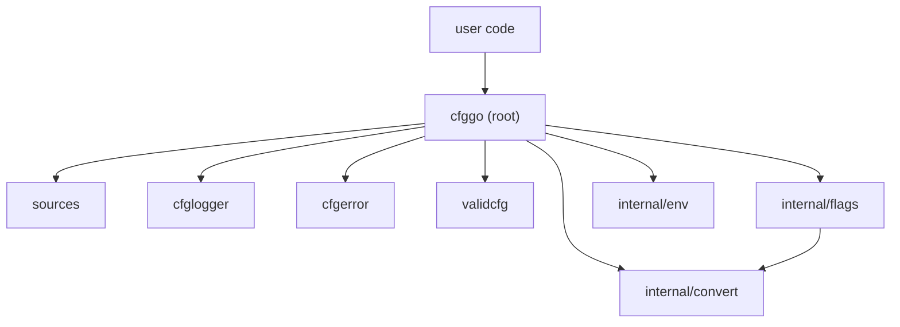

# cfggo - Code Structure

This document describes the current layout of the `cfggo` codebase.

---

## 1. Design Principles

`cfggo` is a Go *library* that optimises for the import experience of downstream
users. Five guiding principles:

1. **One public package for the common case.** Everything a typical user needs
   lives in the root `cfggo` package.
2. **Small, stable extension packages.** Config sources, loggers, error wrappers,
   and validators are in dedicated sub-packages with narrow, stable interfaces.
3. **All implementation detail lives under `internal/`.** Nothing there is part
   of the public contract.
4. **Exactly one implementation of each concern.** `internal/convert` is the
   single type-conversion engine; `internal/env` is the single env-var mapper;
   `internal/flags` is the single flag adapter.
5. **Every layer compiles and tests green on its own.** The dependency graph is
   acyclic and points inward.

---

## 2. Directory Layout

```
github.com/iqhive/cfggo/
  README.md
  STRUCTURE.md
  LICENSE
  go.mod / go.sum

  # Root package `cfggo` (public API)
  doc.go              # Package overview + usage examples
  structure.go        # Structure type + lifecycle (Init/InitSelf return error)
  config.go           # Get / Set / set (private) / applyLoaded / getAllKeys + Value/MustValue
  errors.go           # Sentinel errors (ErrUnknownKey/ErrNoHandler/ErrSource) + ErrorCode
  provenance.go       # Source enum + Source()/Sources()/SourceChain() value provenance
  watch.go            # Change type + OnChange change-notification callbacks
  plan.go             # Cached per-type struct plan (planForType/applyPlan),
                      #   typed accessors + readTyped, reflection-free Init wiring,
                      #   suspect (tagged-but-non-accessor) field detection
  fieldmeta.go        # fieldInfo metadata type + unrecognizedKeys + secret masking
  fields.go           # createFlags (flag registration from the config map)
  diagnose.go         # DiagnoseData (canonical snapshot) + Diagnose/ConfigReference/
                      #   Report + shared human-dump renderer (Explain/String)
  options.go          # Option type + all With* constructors
  flags.go            # Flag registration/parsing (delegates to internal/flags)
  env.go              # Env loading (delegates to internal/env)
  loadsave.go         # Load/save + JSON decode + GetHelpTag + shouldIgnoreField + GetJSONBytes
  reload.go           # Hot reload (Reload + ReloadConfig)
  validate.go         # Validation methods on Structure + re-exported validators
  logging.go          # Global Logger / ErrorWrapper vars + per-instance log helpers
  api.go              # Init(), SetLogLevel, SetLogOutput, ParseLogLevel, LogLevel*
  dynamicvar.go       # String to typed-value adapter (uses internal/convert)

  # Public extension packages
  sources/            # ConfigHandler interface + File/HTTP/Env implementations
    sources.go        #   ConfigHandler interface
    file.go           #   HandlerFile
    http.go           #   HandlerHTTP
    env.go            #   HandlerEnv (wired via WithEnvConfig option)
  conf/               # Dependency-free key=value/section format + file handler
  cfglogger/          # Logger interface + DefaultLogger + NoopLogger
    cfglogger.go
  cfgerror/           # Structured error type + default chain-preserving wrapper
    cfgerror.go
  validcfg/           # Validator type + built-in validators + composites
    validation.go     #   Validator type, ValidationError, ValidationErrors, Custom
    validators.go     #   Required, MinLength, MaxLength, Range, OneOf, Regex, Email, URL
    composite.go      #   All, Any
  convert/            # DEPRECATED thin shim over internal/convert
    convert.go        #   Removal scheduled for next minor/major version bump

  # Internal implementation (not importable by users)
  internal/
    convert/          # The single type-conversion engine
      convert.go      #   ConvertValue(any to type) + ConvertString(string to type)
      convert_test.go
    flags/            # flag.Value adapter that bridges flag parsing to config map
      configvar.go    #   ConfigVar (delegates string parsing to internal/convert)
      flags.go        #   FilterTestFlags
    env/              # Environment-variable to config-key name mapping + lookup
      env.go

  # Examples
  examples/
    README.md         # Example index and key patterns
    basic/
      main.go         # Basic usage, per-instance loggers
      config.json
    advanced/
      main.go         # Custom loggers and error wrappers
      config.json
    validation/
      main.go         # All built-in validators + custom validator
      config.json
    conf-simple/       # Root values, [global], comments, typed conversion
      main.go
      config.conf
    conf-advanced/     # Groups, limits, JSON leaf values, deterministic rewrite
      main.go
      config.conf

  testdata/           # Test fixtures (canonical, single directory)
    test.json
```

---

## 3. Layering & Dependency Rules

Dependencies point **inward and downward** only. No `internal/` package imports
the root package; no import cycles.



---

## 4. Public API Surface

### Root `cfggo` package

| Symbol | Purpose |
|--------|---------|
| `Structure` | Embedded type; all config structs embed this |
| `DefaultValue[T](x T) func() T` | Returns a function that always returns x |
| `Init(parent, ...Option)` | Package-level wrapper; errors if `parent` does not embed `Structure` |
| `Option` / all `With*` funcs | Configuration options for Init (incl. `WithIgnoreKeys`) |
| `Get` / `Set` / `GetJSONBytes() ([]byte, error)` / `String` | Config-map accessors |
| `Value[T]` / `MustValue[T]` | Type-safe generic value accessors |
| `Source` / `Sources` / `SourceChain` | Per-key provenance (final source, all sources, override chain) |
| `Explain` / `Report` | Human-readable, secret-masked dumps |
| `DiagnoseData` / `Diagnose` | Canonical structured snapshot (build custom reports from this) |
| `ConfigReference` | Static field reference table (key, type, env, default, help) |
| `OnChange(func([]Change))` | Change notifications carrying key, old, new, source |
| `ReloadConfig()` | Hot reload from all sources |
| `RegisterValidator` / `AddValidator` / `Validate` / `ValidateKey` | Validation |
| `Required`, `Range`, `OneOf`, `Regex`, `Email`, `URL`, `MinLength`, `MaxLength`, `All`, `Any`, `Custom` | Re-exported validator constructors |
| `Logger` / `ErrorWrapper` | Global logger and error wrapper (replaceable) |
| `SetLogLevel` / `SetLogOutput` / `ParseLogLevel` / `LogLevel*` | Log control |
| `ConvertValue` | **Deprecated** - use `Structure.Set` instead |

### Extension packages

| Package | Exports |
|---------|---------|
| `sources` | `ConfigHandler` interface, `HandlerFile`, `HandlerHTTP`, `HandlerEnv` |
| `conf` | Dependency-free `.conf` codec, limits, and `FileHandler` |
| `cfglogger` | `Logger` interface, `DefaultLogger`, `NoopLogger` |
| `cfgerror` | `Error`, `Wrapper`, default chain-preserving wrapper |
| `validcfg` | `Validator` type, all built-in validators |

---
